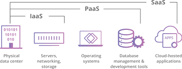
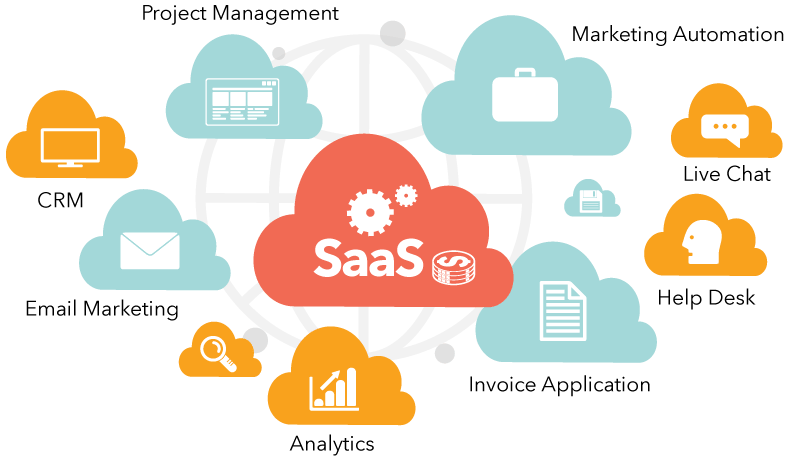

<link rel="stylesheet" href="css/azure.css">

# Microsoft Azure

## What is Azure?
At its core, Azure is a public cloud computing platform—with solutions including <b>Infrastructure as a Service (IaaS)</b>, <b>Platform as a Service (PaaS)</b>, and <b>Software as a Service (SaaS)</b> that can be used for services such as analytics, virtual computing, storage, networking, and much more. It can be used to replace or supplement your on-premise servers.

### Infrastructure as a Service (IaaS)

<table cellspacing="0" cellpadding="0">
<tr>
<td width=500  align="center">

</td>
<td width=500>
Infrastructure as a service <b>(IaaS)</b> is an instant computing infrastructure, provisioned and managed over the internet. ... A cloud computing service provider, such as <b> Azure</b>, manages the infrastructure, while you purchase, install, configure, and manage your own software—operating systems, middleware, and applications.
</td>
</tr>
</table>

### Platform as a Service (PaaS)
<table cellspacing="0" cellpadding="0">
<tr>
<td width=500  align="center">

</td>
<td width=500>
<b>Azure</b> Platform As A Service. Platform as a service <b>(PaaS)</b> is a deployment and development environment within the cloud that delivers simple cloud-based apps to complex, cloud-enabled applications. ... <b>Azure</b> Cloud Services has two main components; the application files such as the source code, DLL, etc.
</td>
</tr>
</table>

### Software as a Service (SaaS)

<table cellspacing="0" cellpadding="0">
<tr>
<td width=500  align="center">

</td>
<td width=500>
Software as a service <b>(SaaS)</b> allows users to connect to and use cloud-based apps over the Internet. Common examples are email, calendaring and office tools (such as Microsoft Office 365). <b>SaaS</b> provides a complete software solution which you purchase on a pay-as-you-go basis from a cloud service provider.
</td>
</tr>
</table>

## Microsoft Azure Features
 1. Improved Backup and Disaster Recovery  
	Azure is a backup and disaster recovery dream tool because of its flexibility, advanced site recovery, and built-in integration. As a cloud-based solution, Azure can back up your data in almost any language, on any OS, and from any location. Azure backup stores three copies of your data in three different locations in the data center, and then another three copies in a remote Azure data center, so you never have to worry about losing data.
	
 1. AutoScale is a feature built into Azure Web Apps that adjusts your resources automatically based on customer web traffic so you have the resources you need when traffic is high, and save money when you’re not in peak times. Automatic Patch Management consists of scanning computers, mobile devices or other machines on a network for missing software updates, known as “patches” and fixing the problem by deploying those patches as soon as they become available.
	
1. Integration with Active Directory  
	If you have multiple locations or use on-premise apps or cloud apps like Microsoft 365, Active Directory integration with Azure will be the central tool for managing and maintaining access to all of these tools.
	
1. Design with Security in Mind
	The enhanced security of Azure is a huge asset for IoT solutions, which traditionally have security gaps that hackers can take advantage of. Other benefits include remote monitoring and predictive maintenance and analytics. Getting started is easy with Azure IoT solution accelerators, preconfigured templates that are customizable to your needs.
	
1. Design for Scalable Performance  
	One of the great features of Azure service is its ability to auto scale according to the demands of the application usage. Basically, increasing or decreasing the resources for application is called scaling. Instance is created each time a web app is deployed.

