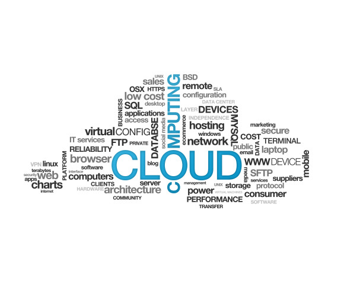

# **Cloud Computing**

## What is Cloud Computing?

Cloud computing means storing and accessing data and programs over the Internet instead of your computer's hard drive. It is the on-demand availability of data storage resources(cloud storage) and computing power, without direct active management by the user.

For it to be considered "cloud computing," you need to access your data or your programs over the Internet, or at the very least, have that data synced with other information over the Web. In a big business, you may know all there is to know about what's on the other side of the connection; as an individual user, you may never have any idea what kind of massive data processing is happening on the other end. The end result is the same: with an online connection, cloud computing can be done anywhere, anytime.

## Pros and Cons of Cloud Computing

Pros|Cons
----|----
No administrative or management hassles|Limited control of infrastructure
Easy accessibility|Restricted or limited flexibility
Pay per use|Ongoing costs
Reliability|Security

Everyone should certainly analyze their current IT infrastructure, weigh their limitations and workload or application restrictions, if any, and then evaluate whether the cloud will solve or remove their present issues and limitations.

### Pros

#### No cost on infrastructure
Cloud computing is divided into three major categories as per the services: Infrastructure as a Service (IaaS), Platform as a Service (PaaS) and Software as a Service (SaaS).

In all these categories, one thing is common that you don’t need to invest in hardware or any infrastructure. In general, every organization has to spend a lot on their IT infrastructure to set up and hire a specialized team.

Servers, network devices, ISP connections, storage, and software – these are the major things on which you need to invest if we talk about general IT infrastructure.

#### Accessibility and pay per use 
Cloud resources are easily accessible from around the globe – anytime, anywhere and from any device and you have complete access to your resources.

This decides your billing also -you only pay for what you use and how much you use. It’s like your phone or electricity bill. But with other IT infrastructure, one spends the complete amount in one go and it is very very rare that those resources are used optimally and thus, the investment goes waste.

#### Reliability
Your infrastructure in the cloud increases the reliability and availability of applications and services. Cloud services run on pooled and redundant infrastructure which provides you with a higher availability of IT services.

### Cons

####Limited control of infrastructure
Since you are not the owner of the infrastructure of the cloud, hence you don’t have any control or have limited access to the cloud infra.

#### Restricted or limited flexibility 
The cloud provides a huge list of services, but consuming them comes with a lot of restrictions and limited flexibility for your applications or developments. Also, platform dependency or ‘vendor lock-in’ can sometimes make it difficult for you to migrate from one provider to another.

#### Ongoing costs 
Although you save your cost of spending on whole infrastructure and its management, on the cloud, you need to keep paying for services as long as you use them. But in traditional methods, you only need to invest once.

#### Security 
Security of data is a big concern for everyone. Since the public cloud utilizes the internet, your data may become vulnerable.

It is easy to see how the advantages of cloud computing simply outweigh the drawbacks. Decreased costs, reduced downtime, and less management effort are benefits that speak for themselves.

## Top 5 Cloud Computing Service Providers

 1. Microsoft Azure 
 1. Amazon Web Services
 1. Salesforce 
 1. SAP 
 1. IBM Cloud
 
 

